# Feetech STS3215 Servo Motor Library

Professional motor control library for Feetech STS3215 servos, based on the [LeRobot](https://github.com/huggingface/lerobot) motors implementation.

## Features

- ✅ **Reliable Communication** - Uses official Feetech SDK with verified packet handling
- ✅ **Multiple Operating Modes** - Position, Velocity (wheel), PWM, and Step modes
- ✅ **Error Detection** - Full status packet verification and error handling
- ✅ **Production Tested** - Based on LeRobot's battle-tested implementation
- ✅ **Clean API** - Simple, intuitive interface for motor control
- ✅ **DualSense Controller Support** - PS5 controller with auto-calibration
- ✅ **Real-time Control** - 20Hz control loop for responsive operation

## Quick Overview

```mermaid
mindmap
  root((Feetech STS3215<br/>Motor Library))
    Hardware
      3x STS3215 Servos
      USB-Serial Adapter
      6-12V Power Supply
      PS5 DualSense Optional
    Software
      LeRobot Based
      Feetech SDK
      Sign-Magnitude Encoding
      Python 3.11+
    Control Modes
      Position Mode
        Precise Angles
        Arm Joints
      Velocity Mode
        Continuous Rotation
        Robot Wheels ✓
      PWM Mode
        Open Loop
      Step Mode
        Stepper Emulation
    Examples
      Position Control
      Velocity Test
      Servo Scanner
      Base Control
        Keyboard Input
        DualSense Controller
        20Hz Loop
        Auto Calibration
      Movement Test
```



## System Architecture

```mermaid
graph TB
    subgraph "User Input"
        KB[⌨️ Keyboard]
        PS5[🎮 DualSense Controller wire/BT]
    end

    subgraph "Control Software"
        Input[Input Handler<br/>20Hz Loop]
        Calib[Calibration System<br/>Auto-calibrate on startup]
        Calc[Velocity Calculator<br/>3-wheel kinematics]

        KB --> Input
        PS5 --> Calib --> Input
        Input --> Calc
    end

    subgraph "Motor Communication"
        Bus[FeetechMotorsBus<br/>USB Serial]
        SDK[Feetech SDK<br/>Packet Handling]

        Calc --> Bus
        Bus --> SDK
    end

    subgraph "Hardware"
        M1[Motor 1 - Left<br/>ID: 1]
        M2[Motor 2 - Right<br/>ID: 2]
        M3[Motor 3 - Back<br/>ID: 3]

        SDK -->|Goal_Velocity| M1
        SDK -->|Goal_Velocity| M2
        SDK -->|Goal_Velocity| M3
    end

    style KB fill:#4A90E2,stroke:#333,stroke-width:2px,color:#fff
    style PS5 fill:#4A90E2,stroke:#333,stroke-width:2px,color:#fff
    style Input fill:#7ED321,stroke:#444,stroke-width:2px
    style Calc fill:#7ED321,stroke:#888,stroke-width:2px
    style Bus fill:#F5A623,stroke:#333,stroke-width:2px
    style M1 fill:#BD10E0,stroke:#333,stroke-width:2px,color:#fff
    style M2 fill:#BD10E0,stroke:#333,stroke-width:2px,color:#fff
    style M3 fill:#BD10E0,stroke:#333,stroke-width:2px,color:#fff
```



## Directory Structure

```
motors/
├── motors_bus.py          # Base motor bus abstract class
├── encoding_utils.py      # Encoding utilities (sign-magnitude)
├── utils.py              # Utility functions and error classes
├── __init__.py           # Package exports
├── feetech/              # Feetech-specific implementation
│   ├── feetech.py        # FeetechMotorsBus implementation
│   ├── tables.py         # Register control tables
│   └── __init__.py
├── examples/             # Example scripts
│   ├── basic_position_control.py           # Simple position control
│   ├── velocity_mode_test.py               # Velocity/wheel mode
│   ├── scan_servos.py                      # Scan for servos
│   ├── keyboard_controller_base_control.py # Keyboard + DualSense control
│   └── test_base_movements.py              # Test base movements
└── README.md            # This file
```

## Installation

### 1. Install Dependencies

```bash
pip install feetech-servo-sdk pyserial deepdiff
```

### 2. (Optional) Install DualSense Controller Support

For PS5 controller support with keyboard control example:

**macOS:**
```bash
pip install pydualsense hidapi
```

**Windows/Linux:**
```bash
pip install pydualsense
```

**Note:**
- macOS requires `hidapi` for USB HID device access
- If you don't have a DualSense controller, the keyboard control will still work perfectly without these packages
- Controller can connect via USB or Bluetooth on all platforms

### 3. Verify Installation

```bash
python examples/scan_servos.py --port COM3
```

## Quick Start

### Position Mode (Default)

Move servos to specific positions:

```python
from motors.motors_bus import Motor, MotorNormMode
from motors.feetech import FeetechMotorsBus, OperatingMode

# Configure motors
motors = {
    "motor_1": Motor(id=1, model="sts3215", norm_mode=MotorNormMode.DEGREES)
}

# Connect
bus = FeetechMotorsBus(port="COM3", motors=motors, protocol_version=0)
bus.connect()

# Enable and move
bus.enable_torque()
bus.write("Goal_Position", "motor_1", 512)  # Move to center
```

### Velocity Mode (Continuous Rotation)

Run motors like wheels:

```python
# Disable torque before mode change
bus.disable_torque()

# Switch to velocity mode
bus.write("Operating_Mode", "motor_1", OperatingMode.VELOCITY.value)

# Enable and rotate
bus.enable_torque()
bus.write("Goal_Velocity", "motor_1", 600)  # Rotate at speed 600

# Stop with retries
for _ in range(5):
    bus.write("Goal_Velocity", "motor_1", 0)
    time.sleep(0.02)
```

## Examples

### 1. Basic Position Control

Move servos through a sequence of positions:

```bash
python examples/basic_position_control.py --port COM3 --motor-ids 1 2 3
```

### 2. Velocity Mode Test

Test continuous rotation (one motor at a time):

```bash
python examples/velocity_mode_test.py --port COM3 --motor-ids 1 2 3 --velocity 600 --duration 5
```

**Parameters:**
- `--velocity`: Rotation speed (0-1023)
- `--torque-limit`: Torque limit (0-1023)
- `--duration`: Seconds per motor

### 3. Scan for Servos

Detect all servos on the bus:

```bash
python examples/scan_servos.py --port COM3 --max-id 10
```

### 4. 3-Wheel Omnidirectional Base Control

Real-time control with **keyboard + DualSense controller** support!

```bash
python examples/keyboard_controller_base_control.py --port COM3 --speed 400
```

**How it works:**
- Control loop runs at **20Hz** (50ms intervals)
- **Command stream** - continuously sends velocities to motors
- **Keyboard**: HOLD key → motors move, RELEASE → motors stop immediately
- **Controller**: Analog joystick control with deadzone
- **Both inputs can be used simultaneously!**
- Displays command stream every 0.5s showing input source and motor velocities
- Responsive, arcade-style control!

**Motor Configuration:**


**Movement Patterns:**

```mermaid
graph LR
    subgraph "Forward/Back"
        F[W: Forward<br/>M1 & M2 同向]
        B[S: Back<br/>M1 & M2 反向]
    end

    subgraph "Strafe Left/Right"
        L[A: Strafe Left<br/>M3 旋转]
        R[D: Strafe Right<br/>M3 反向]
    end

    subgraph "Rotation"
        RL[Q: Rotate Left<br/>M1 & M2 反向]
        RR[E: Rotate Right<br/>M1 & M2 反向]
    end

    style F fill:#7ED321,stroke:#333,stroke-width:2px
    style B fill:#7ED321,stroke:#333,stroke-width:2px
    style L fill:#F5A623,stroke:#333,stroke-width:2px
    style R fill:#F5A623,stroke:#333,stroke-width:2px
    style RL fill:#BD10E0,stroke:#333,stroke-width:2px,color:#fff
    style RR fill:#BD10E0,stroke:#333,stroke-width:2px,color:#fff
```



**Keyboard Controls (HOLD to move, RELEASE to stop):**
- `W` - Forward (left & right motors forward)
- `S` - Back (left & right motors backward)
- `A` - Strafe Left (back motor rotates)
- `D` - Strafe Right (back motor opposite)
- `Q` - Rotate Left (left & right opposite directions)
- `E` - Rotate Right (left & right opposite directions)
- `SPACE` - Force stop
- `ESC` - Exit

**DualSense Controller (PS5) - Optional:**
- `Left Stick (LX/LY)` - Forward/Back + Strafe Left/Right (combined movement!)
- `Right Stick (RX)` - Rotate Left/Right
- **Auto-calibration on startup** - Release joysticks to center for 2 seconds
- Automatic deadzone filtering (20 units) prevents stick drift
- LED turns blue when connected
- Falls back to keyboard-only if controller not available

**Controller Calibration:**
When the program starts with a controller connected, it will:
1. Prompt you to release all joysticks to center
2. Wait 2 seconds for you to let go
3. Sample joystick positions 10 times
4. Calculate and apply center offsets
5. Display calibration values (e.g., `LX:+2 LY:-1 RX:+0 RY:+3`)

This ensures accurate center position even if your controller has slight drift!

**Control Flow (20Hz Loop):**


### 5. Test Base Movements (Non-Interactive)

Test all 6 movements sequentially:

```bash
python examples/test_base_movements.py --port COM3 --speed 400 --duration 2
```

Tests: forward, back, left, right, rotate_left, rotate_right

## Operating Modes

```mermaid
graph LR
    subgraph "Operating Modes"
        POS[POSITION Mode<br/>Value: 0<br/>🎯 Precise angle control]
        VEL[VELOCITY Mode<br/>Value: 1<br/>⚙️ Continuous rotation]
        PWM[PWM Mode<br/>Value: 2<br/>⚡ Open-loop speed]
        STEP[STEP Mode<br/>Value: 3<br/>📏 Stepper emulation]
    end

    subgraph "Use Cases"
        ARM[Robot Arm Joints<br/>Angle positioning]
        WHEEL[Robot Wheels<br/>Drive base]
        SIMPLE[Simple motor<br/>Basic speed]
        STEPPER[Precision steps<br/>CNC-like]
    end

    POS -.-> ARM
    VEL -.-> WHEEL
    PWM -.-> SIMPLE
    STEP -.-> STEPPER

    style POS fill:#7ED321,stroke:#333,stroke-width:2px
    style VEL fill:#4A90E2,stroke:#333,stroke-width:2px,color:#fff
    style PWM fill:#F5A623,stroke:#333,stroke-width:2px
    style STEP fill:#BD10E0,stroke:#333,stroke-width:2px,color:#fff
```



| Mode | Value | Description | Use Case |
|------|-------|-------------|----------|
| **POSITION** | 0 | Position servo mode | Arm joints, precise positioning |
| **VELOCITY** | 1 | Constant speed mode | Wheels, continuous rotation ✅ |
| **PWM** | 2 | Open-loop speed | Simple speed control |
| **STEP** | 3 | Step servo mode | Stepper motor emulation |

## Common Operations

### Change Servo ID

```python
# Must have only ONE servo connected!
bus.disable_torque()
bus.write("ID", "motor_1", 2)  # Change to ID 2
# Power cycle servo to apply
```

### Set Torque Limit

```python
bus.write("Torque_Limit", "motor_1", 700)  # 0-1023
```

### Read Current Position

```python
position = bus.read("Present_Position", "motor_1")
```

### Emergency Stop

```python
# For velocity mode:
for _ in range(10):
    bus.write("Goal_Velocity", "motor_1", 0)
    time.sleep(0.01)

# Then disable torque
bus.disable_torque()
```

## Troubleshooting

### Motors Don't Move

1. **Check power** - Servos need external power (6-12V)
2. **Verify ID** - Use `scan_servos.py` to find actual IDs
3. **Enable torque** - Call `bus.enable_torque()` after connecting
4. **Check mode** - Ensure correct operating mode for your command

### Communication Errors

1. **Try different baud rate** - Default is 1000000, try 115200
2. **Check cable** - Must be data cable, not charge-only
3. **Verify port** - Windows: COM3, Linux: /dev/ttyUSB0
4. **One operation at a time** - Don't open multiple connections

### Motors Keep Spinning After Script Ends

**This was fixed in the LeRobot implementation!** The SDK properly verifies stop commands.

If it still happens:
1. Make sure using the LeRobot-based code (this library)
2. Always call `bus.disconnect()` in `finally:` block
3. Use proper stop sequence (write 0 with retries, then disable torque)

## Key Differences from Manual Implementation

The LeRobot-based implementation is superior because:

| Aspect | Manual Code | LeRobot/SDK |
|--------|-------------|-------------|
| **Packet verification** | None | Full status packet checking |
| **Error handling** | Silent failures | Exceptions on errors |
| **Checksums** | Potentially buggy | SDK-verified |
| **Register addresses** | Hardcoded guesses | Verified control tables |
| **Stop reliability** | Unreliable | Guaranteed |

### Why encoding_utils.py is Critical

Feetech servos use **sign-magnitude encoding** for velocity values:

```mermaid
graph TB
    subgraph "Sign-Magnitude Encoding (Bit 15)"
        Input[Velocity Value<br/>e.g., -500 or +600]
    end

    Input --> Check{Positive or<br/>Negative?}

    Check -->|Positive +600| EncPos[Bit 15 = 0<br/>Magnitude = 600<br/>Result: 0x0258]
    Check -->|Negative -500| EncNeg[Bit 15 = 1<br/>Magnitude = 500<br/>Result: 0x81F4]

    EncPos --> Motor1[Motor rotates CW ↻]
    EncNeg --> Motor2[Motor rotates CCW ↺]

    style Input fill:#4A90E2,stroke:#333,stroke-width:2px,color:#fff
    style Check fill:#F5A623,stroke:#333,stroke-width:2px
    style EncPos fill:#7ED321,stroke:#333,stroke-width:2px
    style EncNeg fill:#7ED321,stroke:#333,stroke-width:2px
    style Motor1 fill:#BD10E0,stroke:#333,stroke-width:2px,color:#fff
    style Motor2 fill:#BD10E0,stroke:#333,stroke-width:2px,color:#fff
```



**Without `encoding_utils.py`:**
- Sending `-500` would be interpreted as `65036` (two's complement)
- Motor would spin at maximum speed in wrong direction!

**With `encoding_utils.py`:**
- `-500` → `0x81F4` (32500) → Correct direction and speed
- `+600` → `0x0258` (600) → Correct direction and speed

## Important Notes

### Mode Switching

**Always disable torque before changing operating mode:**

```python
bus.disable_torque()
bus.write("Operating_Mode", "motor_1", OperatingMode.VELOCITY.value)
bus.enable_torque()
```

### Velocity Mode Stop Sequence

**Critical:** Write velocity=0 BEFORE disabling torque:

```python
# Correct:
for _ in range(5):
    bus.write("Goal_Velocity", "motor_1", 0)
    time.sleep(0.02)
time.sleep(0.3)  # Wait for motor to stop
bus.disable_torque()

# Wrong:
bus.disable_torque()  # Motor keeps spinning!
```

### Cleanup Pattern

Always use try/finally:

```python
try:
    bus.connect()
    bus.enable_torque()
    # ... your code ...
except Exception as e:
    print(f"Error: {e}")
finally:
    bus.disable_torque()
    bus.disconnect()
```

## Hardware Setup

### Wiring Diagram

```mermaid
graph LR
    subgraph "Power"
        PSU[Power Supply<br/>6-12V DC]
    end

    subgraph "PC"
        Computer[💻 Computer<br/>USB Port]
        Controller[🎮 DualSense<br/>USB/Bluetooth]
    end

    subgraph "Interface"
        USB2Serial[USB-to-Serial<br/>Adapter<br/>COM3]
    end

    subgraph "Servos (Daisy Chain)"
        M1[🔷 Motor 1<br/>ID: 1<br/>Left Wheel]
        M2[🔷 Motor 2<br/>ID: 2<br/>Right Wheel]
        M3[🔷 Motor 3<br/>ID: 3<br/>Back Wheel]
    end

    Computer -->|USB| USB2Serial
    Controller -.->|Control| Computer
    USB2Serial -->|TX/RX| M1
    M1 -->|Data| M2
    M2 -->|Data| M3

    PSU -->|+/- Power| M1
    PSU -->|+/- Power| M2
    PSU -->|+/- Power| M3

    PSU -.->|GND| USB2Serial

    style Computer fill:#4A90E2,stroke:#333,stroke-width:2px,color:#fff
    style Controller fill:#4A90E2,stroke:#333,stroke-width:2px,color:#fff
    style PSU fill:#D0021B,stroke:#333,stroke-width:2px,color:#fff
    style USB2Serial fill:#F5A623,stroke:#333,stroke-width:2px
    style M1 fill:#7ED321,stroke:#333,stroke-width:2px
    style M2 fill:#7ED321,stroke:#333,stroke-width:2px
    style M3 fill:#7ED321,stroke:#333,stroke-width:2px
```



**Important Connections:**
- **Power**: 6-12V DC to all servos (shared power rail)
- **Data**: USB-Serial → Motor 1 → Motor 2 → Motor 3 (daisy chain)
- **Ground**: Common ground between power supply and USB-Serial adapter
- **IDs**: Each servo must have a unique ID (1, 2, 3)

### Physical Layout (Top View)

```
         [Front]
           ↑
    M1 ●━━━━━━━● M2
     ╲         ╱
      ╲       ╱
       ╲     ╱
        ╲   ╱
         ╲ ╱
          ●
          M3
        [Back]
```

## Advanced Usage

### Sync Write (Move Multiple Motors Simultaneously)

```python
# Not yet implemented in simple wrapper
# Available in direct bus.sync_write() calls
```

### Custom Acceleration

```python
bus.write("Acceleration", "motor_1", 50)  # 0-254
```

### Read Motor Status

```python
voltage = bus.read("Present_Voltage", "motor_1")
temp = bus.read("Present_Temperature", "motor_1")
moving = bus.read("Moving", "motor_1")
```

## Credits

This implementation is based on:
- [LeRobot](https://github.com/huggingface/lerobot) by HuggingFace
- [Feetech Servo SDK](https://github.com/ftservo/FTServo_Python)
- [XLeRobot](https://github.com/Vector-Wangel/XLeRobot) reference implementation

## License

Apache License 2.0 (same as LeRobot)

## Support

For issues:
1. Check examples first
2. Verify hardware connections
3. Test with `scan_servos.py`
4. Review troubleshooting section above
